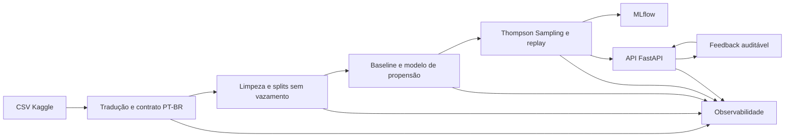
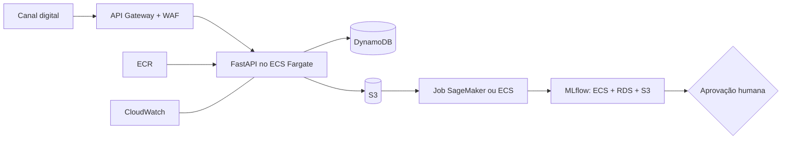

# Datathon 7MLET — Grupo 101

> Uma plataforma de experimentação adaptativa que escolhe o próximo melhor canal de
> contato, aprende com o feedback e mostra todo o caminho da decisão — dos dados ao
> monitoramento.

## Equipe responsável

- Jean Carlos Bezerra Macena da Silva
- Sofia Couto Freitas
- Gabriel Lucas Mendes Comenale
- Veronica Nunes Garcia

As decisões de negócio, implementação e risco são responsabilidade do Grupo 101. Uma
política candidata só pode ser promovida após revisão humana por uma pessoa diferente de
seu autor.

## A história do projeto

Imagine uma instituição financeira que precisa entrar em contato com um cliente. Ela pode
usar celular ou telefone, mas repetir sempre a mesma regra desperdiça oportunidades e não
permite aprender com os resultados.

Nosso desafio foi construir um ciclo completo de Machine Learning Engineering que:

1. transforma e valida os dados históricos;
2. estabelece uma regra simples como referência;
3. testa uma política adaptativa que equilibra exploração e explotação;
4. disponibiliza a decisão por uma API;
5. recebe feedback e mantém uma trilha auditável;
6. permite acompanhar dados, experimentos, execução e saúde operacional.

A base não contém várias ofertas para o mesmo cliente. Por isso, fizemos uma escolha
honesta de escopo: o sistema recomenda **o próximo canal de contato**, e não um produto
financeiro.

| Elemento | Definição no projeto |
|---|---|
| Decisão | escolher o canal do próximo contato elegível |
| Braços | `celular` e `telefone` |
| Recompensa | `1` quando houve conversão; `0` caso contrário |
| Baseline | usar sempre o canal com melhor conversão no treino |
| Política adaptativa | Thompson Sampling segmentado |
| Limite central | associação histórica não demonstra efeito causal do canal |

## O que os dados nos ensinaram

Usamos a base pública [Bank Marketing no Kaggle](https://www.kaggle.com/datasets/henriqueyamahata/bank-marketing),
versão 1, publicada em 06/06/2018. O Kaggle informa a licença como “Other (specified in
description)” e referencia o [UCI Machine Learning Repository](https://archive.ics.uci.edu/dataset/222/bank+marketing),
que atualmente distribui a base sob CC BY 4.0.

O snapshot bruto possui 41.188 registros e 21 colunas. Seu SHA-256 é:

```text
74adfc578bf77a7ff4bb1ba4a9f8709d9e3c6907342959c2c8416847e0afb4d8
```

A exploração revelou quatro cuidados importantes:

- a conversão positiva representa aproximadamente 11,3% dos registros;
- existem 12 linhas integralmente duplicadas;
- `unknown` representa ausência semântica e precisa continuar visível;
- `duration` só é conhecida depois do contato e causaria vazamento de informação.

Por isso, `duration` permanece apenas na auditoria e nunca entra no modelo ou na política.
As transformações são ajustadas somente no treino, depois da divisão estratificada em
treino, validação e teste.

As análises completas estão nos notebooks [01 — EDA](notebooks/01_EDA.ipynb) e
[02 — Preparação](notebooks/02_preparation.ipynb).

## Da base bruta até uma recomendação



| Marco | O que acontece | Evidência principal |
|---|---|---|
| M1 | traduz e valida a fonte sem alterar o arquivo bruto | [notebook de EDA](notebooks/01_EDA.ipynb) |
| M2 | remove duplicatas, bloqueia vazamentos e prepara os splits | [notebook de preparação](notebooks/02_preparation.ipynb) |
| M3 | treina baseline fixo, Dummy e Regressão Logística | [relatório M3](reports/modeling/m3_metrics.json) |
| M4 | compara Thompson Sampling com o baseline em replay | [relatório M4](reports/policy/m4_policy_evaluation.json) |
| M5 | serve recomendações, recebe feedback e executa o golden set | [resultado do golden set](reports/serving/golden_set_results.json) |
| M6 | empacota, orquestra e monitora a solução | [runbook](observability/README.md) |

Como demonstração de consumo em um sistema de negócio, o projeto também possui uma API
Java de simulação de CRM. Os requisitos, premissas, modelo PostgreSQL normalizado e comandos
estão em [CRM Simulator](CRM_README.md).

## O resultado principal

A Regressão Logística atingiu no teste:

- PR-AUC de **0,4664**;
- ROC-AUC de **0,8129**;
- Brier score de **0,0771**;
- precision de **45,37%** e recall de **57,04%** no limiar escolhido na validação.

Para a decisão de canal, comparamos as políticas na mesma sequência histórica:

| Política no teste | Recompensa nos eventos aceitos | Cobertura do replay | Recompensa cumulativa | Exploração |
|---|---:|---:|---:|---:|
| Melhor canal histórico | 15,19% | 63,11% | 592 | 0% |
| Thompson Sampling | 17,94% | 41,11% | 454,6 em média | 13,40% |

O Thompson Sampling apresentou lift médio de **2,75 pontos percentuais**, ou **18,13%**
relativos, com IC95% bootstrap de **[2,53; 2,99] p.p.** em 30 seeds.

Esse resultado aprova a política como **candidata**, mas não prova que trocar o canal
causaria a conversão. O replay só revela recompensa quando a recomendação coincide com o
canal registrado historicamente; as coberturas também são diferentes. Por isso, recompensa
cumulativa é apenas uma métrica de apoio.

Os notebooks [03 — Modelagem](notebooks/03_modeling_and_baseline.ipynb) e
[04 — Política](notebooks/04_policy_evaluation.ipynb) contam essa etapa visualmente.

## Como a demonstração funciona

A API mantém a política fixa como padrão aprovado. Isso evita promover automaticamente uma
candidata apenas porque ela obteve uma métrica melhor. O Thompson Sampling pode ser usado
explicitamente no modo isolado `adaptive_demo`.

Endpoints principais:

| Método e rota | Finalidade |
|---|---|
| `POST /v1/recommendations` | recomenda um canal elegível |
| `POST /v1/feedback` | registra recompensa de forma idempotente |
| `GET /health` | informa se o processo está vivo |
| `GET /ready` | confirma modelo, política, banco e linhagem |
| `GET /metrics` | publica métricas Prometheus sem payload pessoal |

O golden set passa pelo mesmo endpoint usado na demonstração:

| Cenário | Canal retornado | Observação humana |
|---|---|---|
| campanha anterior com sucesso | celular | não interpretar o histórico como causa |
| campanha anterior com fracasso | celular | não responsabilizar o cliente |
| nenhum contato anterior | celular | confirmar consentimento antes do uso real |
| categoria desconhecida na auditoria | celular | atributo não controla a decisão |
| celular indisponível | telefone | fallback válido, sujeito à elegibilidade |

Os cinco contratos foram aprovados. O notebook
[05 — Golden set e API](notebooks/05_golden_set_and_api.ipynb) apresenta as respostas.

## Execute a história completa

O caminho recomendado usa Podman Desktop/Podman Machine e não exige instalar o pipeline
Python diretamente no host.

Para compilar todas as imagens, subir a aplicação completa (incluindo Airflow e
observabilidade) e aguardar os serviços ficarem saudáveis, execute:

```powershell
Copy-Item .env.example .env
.\scripts\start-all.ps1
```

O script deixa todas as interfaces online. Use `-SkipBuild` para apenas reiniciar os
containers existentes ou `-WithoutAirflow` quando não precisar do orquestrador.

### 1. Suba a API e a observabilidade

```powershell
git clone https://github.com/VehGarciiah/datathon-7mlet-grupo-80
cd datathon-7mlet-grupo-80
Copy-Item .env.example .env
podman compose up -d --build
podman compose ps
```

Interfaces locais:

| Interface | Endereço |
|---|---|
| CRM Web | `http://127.0.0.1` |
| CRM API e Swagger | `http://127.0.0.1:8081` |
| API e Swagger | `http://127.0.0.1:8000/docs` |
| MLflow | `http://127.0.0.1:5000` |
| Grafana | `http://127.0.0.1:3000` |
| Prometheus | `http://127.0.0.1:9090` |
| Alertmanager | `http://127.0.0.1:9093` |

### 2. Execute o pipeline

Sem orquestrador visual:

```powershell
podman compose run --rm --build pipeline
podman compose run --rm --build mlflow-snapshot
podman compose restart api process-exporter
```

Com Airflow:

```powershell
podman compose --profile orchestration up -d --build airflow
```

Abra `http://127.0.0.1:8080`, selecione `datathon_pipeline_m1_m4` e clique em **Trigger**.
Depois de escolher os runs que serão preservados:

```powershell
podman compose run --rm mlflow-snapshot
podman compose restart api process-exporter
```

O job de snapshot recusa runs ativos, faz backup consistente do SQLite e confirma que os
runs finais de M3/M4 possuem parâmetros, métricas e artefatos. Valide o checkout com:

```powershell
python -m scripts.snapshot_mlflow --check-only
```

### 3. Gere uma recomendação

```powershell
curl.exe -X POST http://127.0.0.1:8000/v1/recommendations `
  -H "Content-Type: application/json" `
  --data-binary "@examples/recommendation_request.json"
```

Use o `recommendation_id` retornado para testar o feedback pelo Swagger. Para demonstrar a
política candidata em um estado separado:

```powershell
$env:DATATHON_POLICY_MODE = "adaptive_demo"
podman compose up -d --build api
```

Ao terminar, remova a variável e restaure o modo aprovado:

```powershell
Remove-Item Env:DATATHON_POLICY_MODE
podman compose up -d api
```

### 4. Execute a validação técnica

```powershell
python -m pip install -r requirements.txt
python -m ruff check .
python -m pytest -q
podman compose --profile jobs --profile orchestration config --quiet
```

Para encerrar preservando os volumes:

```powershell
podman compose --profile orchestration down
```

Use `down -v` somente quando quiser apagar também métricas, logs internos, Airflow e a
cópia containerizada do MLflow.

## Quem faz o quê

| Componente | Responsabilidade |
|---|---|
| Airflow | organiza etapas, dependências, retries e logs de execução |
| MLflow | registra parâmetros, métricas, artefatos e histórico de experimentos |
| FastAPI | entrega recomendações e registra feedback |
| Prometheus e Alertmanager | coletam sinais e avaliam regras de alerta |
| Grafana | reúne métricas, logs, traces e alertas em dashboards |
| Loki, Alloy e Tempo | armazenam e correlacionam logs e traces |
| OpenTelemetry Collector | recebe e encaminha a telemetria da API |

O Airflow não substitui o MLflow: um mostra **como o processo executou**; o outro registra
**o que foi experimentado e quais resultados foram obtidos**. A topologia standalone do
Airflow usa LocalExecutor e SQLite porque o objetivo é uma demonstração local reproduzível,
não uma instalação de produção.

## Como levaríamos para a AWS

Em produção, a API seria executada no ECS Fargate atrás de API Gateway e AWS WAF, com
imagens no ECR. DynamoDB armazenaria decisões, feedback idempotente e estado concorrente da
política. S3 guardaria datasets permitidos, relatórios e artefatos; o MLflow usaria RDS para
metadados e S3 para artefatos. Jobs de preparação e treino rodariam em SageMaker ou tarefas
ECS, sempre com gate humano antes da promoção.

CloudWatch concentraria logs, métricas e alarmes. IAM, KMS, Secrets Manager e CloudTrail
garantiriam mínimo privilégio, criptografia, segredos e auditoria. A entrega acadêmica apenas
descreve essa arquitetura; nenhum recurso AWS precisa ser provisionado.



## Uso responsável e limites

- O projeto é educacional e usa uma base pública sem identificadores diretos.
- A API não executa contatos nem toma decisões financeiras automaticamente.
- Campos demográficos e socioeconômicos permanecem somente na auditoria.
- Logs não registram o corpo completo das requisições.
- Consentimento, opt-out, horários e frequência não existem na base e precisam ser
  validados antes de qualquer uso real.
- A recompensa histórica é um proxy observacional, não uma estimativa causal.
- A política fixa continua sendo o rollback enquanto a candidata não recebe aprovação.

Eventos demonstrativos de recomendação e feedback têm retenção prevista de até 90 dias;
logs técnicos, até 30 dias. Qualquer uso com dados reais exigiria nova análise jurídica,
de privacidade e de risco de modelo.

## Onde encontrar cada detalhe

```text
configs/             contratos e parâmetros versionados
data/                fonte, camada PT-BR e splits processados
notebooks/           narrativa analítica M1–M5
src/                 dados, modelo, políticas, avaliação, API e telemetria
tests/               testes unitários, integração, contratos e golden set
artifacts/           modelos, preprocessadores e estados aprováveis
reports/             métricas e evidências legíveis
mlflow.db + mlruns/  snapshot versionado dos experimentos
orchestration/       DAG do Airflow
observability/       configuração e runbook da stack local
```

Consulte o [changelog](CHANGELOG.md) para o histórico consolidado das features e o
[runbook de observabilidade](observability/README.md) para diagnóstico e operação.

## Demo Day

O roteiro recomendado para os cinco minutos é:

1. problema e decisão de canal;
2. base, tradução e remoção do vazamento;
3. baseline versus Thompson Sampling;
4. resultado, cobertura e limitação causal;
5. API gerando uma recomendação;
6. Airflow, MLflow e observabilidade.

**Vídeo final:** pendente de gravação e publicação pelo Grupo 101.
