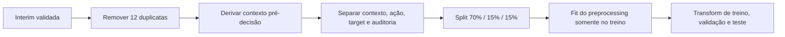

# Datathon 7MLET — Grupo 80

Solução acadêmica de Machine Learning Engineering para experimentação adaptativa em campanhas de marketing. O MVP escolhe o próximo melhor **canal de contato** entre ações elegíveis e aprende com a conversão observada.

> Status: M0–M3 concluídos — contrato, governança, dados PT-BR, preparação sem vazamento, baseline determinístico e baseline preditivo rastreado no MLflow. Thompson Sampling e replay comparativo começam no M4, conforme o [roadmap técnico](specs/ROADMAP_IMPLEMENTACAO.md).

## Visão do problema

Uma instituição financeira digital precisa escolher, para cada oportunidade elegível, qual próximo passo apresentar sem depender apenas de regras fixas e testes A/B longos. O projeto compara uma política determinística com uma política adaptativa baseada em Thompson Sampling, preservando exploração, rastreabilidade e revisão humana.

A base escolhida registra uma única oferta — assinatura de depósito a prazo — e dois canais históricos. Portanto, este projeto **não recomenda produtos diferentes**. A decisão do MVP é qual canal usar no próximo contato elegível.

## Contrato da decisão

O contrato completo e legível por máquina está em [`configs/experiment.yaml`](configs/experiment.yaml).

| Elemento | Definição do MVP |
|---|---|
| Unidade de decisão | uma oportunidade de contato elegível |
| Ações/braços | `celular` e `telefone` |
| Recompensa | `1` quando há assinatura do depósito; `0` caso contrário |
| Janela online inicial | 7 dias após a recomendação; hipótese a validar antes de uso real |
| Baseline | canal com maior conversão calculada somente no treino |
| Política adaptativa | Thompson Sampling Beta-Bernoulli por segmentos com fallback global |
| Saída | próximo melhor canal, versão da política e indicação de exploração |
| Abstenção | nenhuma ação quando elegibilidade ou canal permitido não estiver comprovado |


### Elegibilidade

Em uma operação real, uma recomendação só poderá ser emitida quando:

- existir finalidade e base legal aprovadas para o contato;
- o cliente não estiver em lista de bloqueio ou opt-out;
- houver ao menos um canal permitido e disponível;
- o payload respeitar o contrato de dados;
- limites de frequência e horário definidos pelo negócio forem atendidos.

A base pública não possui consentimento, opt-out, identificador persistente nem regras completas de elegibilidade. Para avaliação acadêmica, cada linha representa somente uma oportunidade histórica observada e nunca uma autorização para contato real.

### Contexto permitido e campos bloqueados

O contexto inicial da política usa momento do contato, histórico de campanhas e indicadores macroeconômicos disponíveis antes da decisão. `pdays=999` será convertido no indicador “nunca contatado anteriormente”. Como `campaign` inclui o contato atual, o pipeline deverá derivar `previous_attempts_current_campaign = campaign - 1` em vez de usar o campo bruto.

| Classificação | Campos | Regra |
|---|---|---|
| Contexto candidato | `month`, `day_of_week`, `pdays`, `previous`, `poutcome`, `emp.var.rate`, `cons.price.idx`, `cons.conf.idx`, `euribor3m`, `nr.employed` | podem entrar após validação e transformação no treino |
| Somente auditoria | `age`, `job`, `marital`, `education`, `default`, `housing`, `loan` | usar em EDA e análise de disparidade; não controlar a política do MVP |
| Bloqueados diretamente | `duration`, `campaign`, `contact`, `y` e identificadores técnicos | duração é pós-contato; `campaign` só alimenta a derivação pré-decisão; ação e recompensa ficam separadas do contexto |

## Dados e proveniência

Foi selecionada a base pública [Bank Marketing no Kaggle](https://www.kaggle.com/datasets/henriqueyamahata/bank-marketing), versão 1, publicada em 06/06/2018. A página do Kaggle identifica a licença como “Other (specified in description)” e referencia como origem o [UCI Machine Learning Repository](https://archive.ics.uci.edu/dataset/222/bank+marketing). A fonte UCI atual publica a base sob CC BY 4.0 e fornece o DOI [10.24432/C5K306](https://doi.org/10.24432/C5K306).

> A licença informada pelo distribuidor Kaggle e a licença atual da fonte UCI são registradas separadamente para não presumir equivalência jurídica. Qualquer redistribuição deve manter atribuição e ser revisada conforme a origem efetivamente utilizada.

| Propriedade do snapshot local | Valor |
|---|---|
| Arquivo | `data/raw/bank-additional-full.csv` |
| Registros | 41.188 |
| Colunas | 21 |
| Tamanho | 5.834.924 bytes |
| SHA-256 | `74adfc578bf77a7ff4bb1ba4a9f8709d9e3c6907342959c2c8416847e0afb4d8` |
| Imutabilidade | obrigatória; transformações serão gravadas fora de `data/raw` |

Citação da fonte original:

> Moro, S., Rita, P., & Cortez, P. (2014). *Bank Marketing* [Dataset]. UCI Machine Learning Repository. https://doi.org/10.24432/C5K306.

Validação de integridade no PowerShell:

```powershell
Get-FileHash -Algorithm SHA256 data\raw\bank-additional-full.csv
```

A variável alvo original é `y`: `yes` representa conversão e `no` representa não conversão. A coluna `duration` será mantida apenas na fonte imutável e em análises explícitas de vazamento; ela não poderá ser usada no treinamento realista nem na decisão.

## Camada canônica PT-BR — M1

O pipeline [`src/data/translate.py`](src/data/translate.py) verifica primeiro o hash da fonte, valida schema e categorias, traduz os dados e somente então grava [`data/interim/bank_marketing_ptbr.csv`](data/interim/bank_marketing_ptbr.csv). A linhagem e os controles de paridade ficam em [`bank_marketing_ptbr.metadata.json`](data/interim/bank_marketing_ptbr.metadata.json).

As chaves, funções e variáveis Python permanecem em inglês. Nomes físicos do dado usam `snake_case` em português sem acentos; documentação, comentários, docstrings e mensagens explicativas usam PT-BR.

### Dicionário de colunas

| Original | Canônica PT-BR | Uso no MVP |
|---|---|---|
| `age` | `idade` | somente auditoria |
| `job` | `profissao` | somente auditoria |
| `marital` | `estado_civil` | somente auditoria; `divorced` representa divorciado ou viúvo na fonte |
| `education` | `escolaridade` | somente auditoria |
| `default` | `inadimplencia` | somente auditoria |
| `housing` | `financiamento_habitacional` | somente auditoria |
| `loan` | `emprestimo_pessoal` | somente auditoria |
| `contact` | `canal_contato` | ação histórica, separada do contexto |
| `month` | `mes_contato` | contexto candidato |
| `day_of_week` | `dia_semana` | contexto candidato |
| `duration` | `duracao_contato` | auditoria de vazamento; proibida no modelo |
| `campaign` | `contatos_campanha_atual` | proibida diretamente; alimentará derivação pré-decisão no M2 |
| `pdays` | `dias_desde_ultimo_contato` | contexto; sentinela 999 será tratada no M2 |
| `previous` | `contatos_campanhas_anteriores` | contexto candidato |
| `poutcome` | `resultado_campanha_anterior` | contexto candidato |
| `emp.var.rate` | `taxa_variacao_emprego` | contexto candidato |
| `cons.price.idx` | `indice_precos_consumidor` | contexto candidato |
| `cons.conf.idx` | `indice_confianca_consumidor` | contexto candidato |
| `euribor3m` | `euribor_3_meses` | contexto candidato |
| `nr.employed` | `numero_empregados` | contexto candidato |
| `y` | `resultado` | recompensa binária, separada do contexto |

O pipeline acrescenta `event_id`, sequencial de 1 a 41.188, apenas para rastreabilidade. Esse identificador está bloqueado como feature.

### Paridade e qualidade

| Controle | Resultado do M1 |
|---|---|
| Registros da fonte/interim | 41.188 / 41.188 |
| Colunas da fonte/interim | 21 / 22, incluindo `event_id` |
| Linhas removidas | 0 |
| Células nulas | 0 |
| Duplicatas de negócio | 12, preservadas para remoção controlada no M2 |
| Target negativo | 36.548 — 88,73% |
| Target positivo | 4.640 — 11,27% |
| SHA-256 da camada interim | `0c073203818b48978ee6e1c9742cbe8b5fa0a6b531de78bf0530a0cf6328fa7c` |

`desconhecido` é uma categoria semântica, não um nulo técnico:

| Campo canônico | Quantidade | Proporção |
|---|---:|---:|
| `inadimplencia` | 8.597 | 20,87% |
| `escolaridade` | 1.731 | 4,20% |
| `financiamento_habitacional` | 990 | 2,40% |
| `emprestimo_pessoal` | 990 | 2,40% |
| `profissao` | 330 | 0,80% |
| `estado_civil` | 80 | 0,19% |

### Principais evidências da EDA

O notebook [`01_EDA.ipynb`](notebooks/01_EDA.ipynb) foi reconstruído para executar do kernel limpo e consumir apenas funções versionadas de `src/data`.

- conversão geral: 11,27%, confirmando desbalanceamento relevante;
- celular: 26.144 registros, 3.853 conversões e taxa histórica de 14,74%;
- telefone: 15.044 registros, 787 conversões e taxa histórica de 5,23%;
- campanha anterior com sucesso: conversão histórica de 65,11%, com suporte de 1.373 registros;
- duração média sem conversão: 220,84 segundos; com conversão: 553,19 segundos.

Os valores por canal são associações observacionais, não efeito causal. A grande diferença de duração demonstra por que `duration`, conhecida depois do contato, deve permanecer bloqueada.

O artefato legado `data/processed/bank_processed.csv` foi removido antes do M2 porque continha `duration` e não possuía pipeline integralmente reproduzível.

## Preparação para modelagem — M2

O pipeline [`src/data/prepare.py`](src/data/prepare.py) consome apenas a camada `interim` validada, remove duplicatas de negócio, deriva contexto pré-decisão, separa ação/target/auditoria e cria splits estratificados antes de ajustar transformações.



### Contrato das features

| Componente | Colunas/regra |
|---|---|
| Identificador | `event_id`, preservado para linhagem e bloqueado como feature |
| Contexto categórico | `mes_contato`, `dia_semana`, `resultado_campanha_anterior` |
| Contexto numérico | dias desde último contato, contatos anteriores, tentativas anteriores na campanha e cinco indicadores macroeconômicos |
| Contexto binário | `nunca_contatado_anteriormente` |
| Ação | `canal_contato`, armazenada separadamente do contexto |
| Target | `resultado`, armazenado separadamente do contexto |
| Somente auditoria | idade, profissão, estado civil, escolaridade, inadimplência e empréstimos |
| Bloqueados | `duracao_contato`, `contatos_campanha_atual`, identificador, ação, target e campos de auditoria |

As duas derivações temporais são:

- `dias_desde_ultimo_contato=999` → valor ausente imputável mais `nunca_contatado_anteriormente=1`;
- `tentativas_anteriores_campanha_atual = contatos_campanha_atual - 1`, evitando expor o contato corrente.

### Deduplicação e splits

As duplicatas são calculadas usando os 21 campos de negócio, sem `event_id`. A primeira ocorrência na ordem da fonte é preservada e os 12 IDs removidos ficam registrados em [`preparation.metadata.json`](data/processed/preparation.metadata.json).

| Split | Registros | Negativos | Positivos | Taxa positiva |
|---|---:|---:|---:|---:|
| Treino | 28.823 | 25.576 | 3.247 | 11,265% |
| Validação | 6.176 | 5.480 | 696 | 11,269% |
| Teste | 6.177 | 5.481 | 696 | 11,268% |
| Total | 41.176 | 36.537 | 4.639 | 11,266% |

Os splits usam `random_seed=42`, estratificação por `resultado`, são disjuntos e ficam ordenados por `event_id` nos arquivos persistidos. Validação escolhe configuração; teste permanece reservado para a avaliação final.

### Preprocessing

O `ColumnTransformer` é ajustado exclusivamente nas 28.823 linhas de treino:

- categóricas: imputação pela moda e one-hot encoding com categorias novas ignoradas de forma controlada;
- numéricas: imputação pela mediana do treino e padronização com estatísticas do treino;
- binária: passagem direta;
- saída: 27 features em matrizes esparsas para treino, validação e teste.

O artefato `artifacts/preprocessing/context_preprocessor.joblib`, as matrizes `.npz` e a lista de features são regeneráveis, mas ficam versionados como evidências reproduzíveis do M2. Os CSVs processados e seus hashes também são versionados:

| Artefato | Finalidade |
|---|---|
| [`train.csv`](data/processed/train.csv) | treino com contexto, ação e target separados por coluna |
| [`validation.csv`](data/processed/validation.csv) | seleção de configuração |
| [`test.csv`](data/processed/test.csv) | avaliação final intocada |
| [`audit.csv`](data/processed/audit.csv) | fatias de auditoria vinculadas por `event_id` e split |
| [`split_assignments.csv`](data/processed/split_assignments.csv) | atribuição reproduzível de cada evento |
| [`preparation.metadata.json`](data/processed/preparation.metadata.json) | hashes, versões, IDs removidos, features, shapes e prevalência |

O notebook [`02_preparation.ipynb`](notebooks/02_preparation.ipynb) demonstra o processo sem duplicar lógica. Testes automatizados comprovam que `duration`, campanha bruta, ação, target, identificador e campos de auditoria não entram no contexto.

## Baselines determinístico e preditivo — M3

O M3 cria duas referências distintas:

1. uma política determinística que sempre recomenda o canal com maior conversão histórica no treino;
2. um modelo de propensão que estima `P(conversão | contexto, canal observado)`.

A política decide uma ação. O modelo preditivo estima uma probabilidade associativa e não deve ser confundido com a política nem com efeito causal.

### Baseline determinístico

A classe [`BestHistoricalActionPolicy`](src/policies/fixed.py) foi ajustada exclusivamente em `train`. Empates são resolvidos pela ordem estável do contrato e, se o melhor braço estiver indisponível, a política usa a primeira ação elegível como fallback.

| Canal no treino | Observações | Conversões | Conversão | IC 95% de Wilson |
|---|---:|---:|---:|---:|
| Celular | 18.313 | 2.699 | 14,738% | 14,232%–15,259% |
| Telefone | 10.510 | 548 | 5,214% | 4,805%–5,656% |

O braço congelado é `celular`. No replay factual:

| Split | Eventos aceitos | Cobertura | Conversões | Recompensa média |
|---|---:|---:|---:|---:|
| Validação | 3.924 | 63,54% | 561 | 14,30% |
| Teste | 3.898 | 63,11% | 592 | 15,19% |

Somente eventos cujo canal histórico coincide com a recomendação possuem recompensa observável. A cobertura deve sempre acompanhar a recompensa; esse resultado não estima causalmente o que ocorreria ao trocar o canal.

### Baseline preditivo

O script [`train_propensity.py`](src/models/train_propensity.py) compara `DummyClassifier(strategy="prior")` com Regressão Logística L2. O pipeline recebe os 12 campos de contexto do M2 mais `canal_contato`, ajusta todo o preprocessing no treino e gera 29 features transformadas.

PR-AUC/average precision é a métrica de seleção por causa do desbalanceamento. O limiar `0,204832` maximiza F1 na validação e é congelado antes do teste.

| Modelo | Split | PR-AUC | ROC-AUC | Brier | F1 |
|---|---|---:|---:|---:|---:|
| Dummy | Validação | 0,1127 | 0,5000 | 0,1000 | 0,0000 |
| Regressão Logística | Validação | 0,4493 | 0,7954 | 0,0790 | 0,4909 |
| Dummy | Teste | 0,1127 | 0,5000 | 0,1000 | 0,0000 |
| Regressão Logística | Teste | 0,4664 | 0,8129 | 0,0771 | 0,5054 |

No teste, o modelo alcançou precision de 45,37%, recall de 57,04% e matriz de confusão `TN=5003`, `FP=478`, `FN=299`, `TP=397`. A PR-AUC de validação superou o Dummy em 0,3366 ponto absoluto, aprovando o gate do M3. Como o Brier e a curva por decis melhoraram de forma consistente contra o Dummy, um calibrador adicional não foi aplicado nesta baseline.

Após gerar as predições, o teste é avaliado em 34 fatias agregadas de idade, profissão, estado civil, escolaridade, inadimplência e empréstimos, todas com pelo menos 100 registros. Esses atributos não são features: o cruzamento ocorre somente pela camada separada de auditoria. PR-AUC varia com a prevalência de cada fatia, então diferenças são sinais para investigação e não comprovam, isoladamente, discriminação ou desempenho superior de um grupo.

Os relatórios versionáveis são:

| Artefato | Conteúdo |
|---|---|
| [`m3_metrics.json`](reports/modeling/m3_metrics.json) | métricas, calibração, matriz de confusão, contratos, hashes e limitações |
| [`fixed_baseline.json`](reports/modeling/fixed_baseline.json) | braço escolhido, suporte, intervalo de confiança e replay |
| [`logistic_coefficients.csv`](reports/modeling/logistic_coefficients.csv) | coeficientes e odds ratios para análise técnica |
| [`validation_predictions.csv`](reports/modeling/validation_predictions.csv) | probabilidades e predições da validação |
| [`test_predictions.csv`](reports/modeling/test_predictions.csv) | probabilidades e predições do teste congelado |
| [`test_slice_metrics.csv`](reports/modeling/test_slice_metrics.csv) | PR-AUC, ROC-AUC, Brier e classificação por fatia de auditoria |

O pipeline treinado fica em `artifacts/models/propensity_pipeline.joblib` e a política em `artifacts/policies/fixed_policy.joblib`. Ambos são regeneráveis, ficam versionados como evidências do M3 e passaram por inferência smoke usando o mesmo preprocessing do treino.

### MLflow

O comando oficial registra onze parâmetros, oito métricas e os artefatos do M3 no experimento `datathon-7mlet-m3-baselines`. O backend é SQLite (`mlflow.db`), pois versões atuais do MLflow mantêm o antigo file store apenas em modo de manutenção. O banco, `mlruns/` e `artifacts/` são versionados intencionalmente para permitir auditoria acadêmica, estudo e reprodução por outro desenvolvedor. Nenhum segredo ou dado operacional real deve ser armazenado nesses diretórios.

O identificador da execução mais recente está em [`latest_mlflow_run.json`](reports/modeling/latest_mlflow_run.json). O notebook [`03_modeling_and_baseline.ipynb`](notebooks/03_modeling_and_baseline.ipynb) apenas reproduz os relatórios e não cria runs extras.

### Limites de interpretação

- o canal observado não foi alocado aleatoriamente;
- não existe recompensa contrafactual para o canal não executado;
- coeficientes regularizados representam associações condicionais, não regras causais;
- atributos demográficos e financeiros da camada de auditoria não entram no modelo;
- o limiar técnico maximiza F1 e deverá ser substituído por uma regra baseada em custo/capacidade antes de produção.

## Critérios de sucesso

- negócio: taxa de conversão e lift absoluto/relativo contra o baseline;
- política: recompensa média e acumulada, distribuição de braços e cobertura do replay;
- incerteza: intervalo de confiança de 95% e no mínimo 30 seeds para a política estocástica;
- aprovação: configuração congelada, ausência de vazamento e limitações apresentadas junto às métricas;
- operação: possibilidade de abstenção e rollback para o baseline aprovado.

A política adaptativa só poderá ser marcada como candidata se superar o baseline no protocolo pré-registrado. Caso não supere, o resultado será documentado sem seleção oportunista de seed, subconjunto ou métrica.

## Governança e uso responsável

### Finalidade e base legal

O uso atual é exclusivamente educacional, com uma base pública sem identificadores diretos. Isso não autoriza o uso de dados reais. Antes de produção, Jurídico/Compliance deverá aprovar finalidade, base legal, transparência, direitos do titular, regras de contato, opt-out e tratamento de clientes vulneráveis.

A solução é apoio à decisão. Ela não concede crédito, altera preço, define condição financeira, executa contato automaticamente nem substitui julgamento humano.

### Minimização e retenção

- não coletar identificadores diretos, renda, patrimônio, gênero, raça ou regras comerciais privadas;
- não registrar payload completo em logs técnicos;
- manter atributos de maior risco somente para auditoria até existir justificativa e aprovação;
- reter eventos de recomendação e feedback por até 90 dias no ambiente demonstrativo;
- reter logs técnicos por até 30 dias;
- revisar a necessidade de retenção a cada 30 dias;
- excluir registros e derivados ao encerrar a finalidade ou vencer o prazo.

### Responsabilidades e aprovação

| Papel | Responsável no M0 | Responsabilidade |
|---|---|---|
| Negócio | Grupo 80 | aprovar objetivo, recompensa, elegibilidade e interpretação |
| Técnico | Grupo 80 | garantir reprodução, testes, segurança e operação |
| Risco de modelo | revisão por par do Grupo 80 | revisar vazamento, métricas, disparidades, limitações e rollback |

Quando houver mais de um integrante, a aprovação de uma versão candidata deverá vir de uma pessoa diferente de seu autor. Os nomes individuais serão registrados antes da primeira promoção de modelo.

### Registro inicial de riscos

| ID | Risco | Controle definido no M0 |
|---|---|---|
| R01 | confundir canal com produto/oferta | contrato e comunicação usam “próximo melhor canal” |
| R02 | vazamento por `duration` ou `campaign` bruto | denylist e derivação de contexto pré-decisão |
| R03 | tratar associação histórica como causalidade | replay com cobertura e limitação observacional junto às métricas |
| R04 | discriminação por atributos proxy | campos de risco somente para auditoria e gate humano |
| R05 | contato sem autorização ou acima de limites | abstenção quando elegibilidade não estiver comprovada |
| R06 | feedback duplicado ou atribuído ao braço errado | `recommendation_id` idempotente e vínculo validado |
| R07 | política adaptativa degradar a conversão | monitoramento e rollback para baseline aprovado |

## Limitações conhecidas

- os dados são observacionais e não contêm a propensão da política histórica;
- apenas o resultado da ação executada é conhecido; não existe contrafactual por cliente;
- a base possui uma oferta e dois canais, não um catálogo de produtos;
- consentimento, custo de contato, elegibilidade e identificadores persistentes não estão disponíveis;
- `duration` é conhecida somente depois da ligação e causa vazamento;
- a base é ordenada por data, mas não oferece uma data completa por registro para reconstrução temporal rigorosa;
- associações por canal ou perfil não devem ser apresentadas como efeito causal.

## Estrutura atual

```text
datathon-7mlet-grupo-80/
├── configs/
│   ├── data.yaml
│   ├── experiment.yaml
│   └── modeling.yaml
├── data/
│   ├── interim/
│   │   ├── bank_marketing_ptbr.csv
│   │   └── bank_marketing_ptbr.metadata.json
│   ├── raw/
│   │   └── bank-additional-full.csv
│   └── processed/
│       ├── audit.csv
│       ├── preparation.metadata.json
│       ├── split_assignments.csv
│       ├── test.csv
│       ├── train.csv
│       └── validation.csv
├── notebooks/
│   ├── 01_EDA.ipynb
│   ├── 02_preparation.ipynb
│   └── 03_modeling_and_baseline.ipynb
├── artifacts/                       # preprocessadores, modelos e políticas versionados
├── mlruns/                          # artefatos das execuções registradas no MLflow
├── mlflow.db                        # metadados e métricas das execuções do MLflow
├── reports/
│   └── modeling/
│       ├── fixed_baseline.json
│       ├── latest_mlflow_run.json
│       ├── logistic_coefficients.csv
│       ├── m3_metrics.json
│       ├── test_predictions.csv
│       ├── test_slice_metrics.csv
│       └── validation_predictions.csv
├── src/
│   ├── data/
│   │   ├── contracts.py
│   │   ├── prepare.py
│   │   ├── translate.py
│   │   └── validate.py
│   ├── features/
│   │   └── build_features.py
│   ├── models/
│   │   └── train_propensity.py
│   └── policies/
│       ├── base.py
│       └── fixed.py
├── scripts/
│   └── rebase_mlflow_paths.py       # adapta URIs do MLflow ao caminho do clone
├── specs/
│   ├── fiap-postech-mlet-datathon.pdf
│   └── ROADMAP_IMPLEMENTACAO.md
├── tests/
│   ├── integration/
│   └── unit/
├── README.md
└── requirements.txt
```

## Como executar o estado atual

Clone o repositório:

```bash
git clone https://github.com/VehGarciiah/datathon-7mlet-grupo-80
cd datathon-7mlet-grupo-80
```

Crie e ative um ambiente virtual e instale as dependências:

```powershell
python -m venv .venv
.\.venv\Scripts\Activate.ps1
python -m pip install -r requirements.txt
```

Adapte os caminhos dos artefatos registrados no SQLite ao diretório do clone atual:

```powershell
python scripts/rebase_mlflow_paths.py
```

O MLflow persiste URIs absolutas no banco. Esse comando altera somente `artifact_location` e `artifact_uri` em `mlflow.db`, preservando runs, parâmetros, métricas e artefatos. Use `python scripts/rebase_mlflow_paths.py --check-only` para verificar o vínculo depois da adaptação. É normal que o banco versionado apareça como modificado localmente quando o clone estiver em outro caminho.

Valide o contrato YAML:

```powershell
python -c "from pathlib import Path; import yaml; yaml.safe_load(Path('configs/experiment.yaml').read_text(encoding='utf-8')); print('Contrato válido')"
```

Gere novamente a camada canônica PT-BR:

```powershell
python -m src.data.translate --config configs/data.yaml
```

Gere os splits e o preprocessing do M2:

```powershell
python -m src.data.prepare --config configs/data.yaml
```

Execute todos os testes:

```powershell
python -m pytest -q
```

Execute o notebook de análise:

```powershell
jupyter notebook notebooks/01_EDA.ipynb
```

Execute o notebook de preparação:

```powershell
jupyter notebook notebooks/02_preparation.ipynb
```

Treine os baselines e registre o experimento no MLflow:

```powershell
python -m src.models.train_propensity --config configs/modeling.yaml
```

Abra a interface local do MLflow:

```powershell
python -m mlflow ui --backend-store-uri sqlite:///mlflow.db --port 5000
```

Execute o notebook do M3:

```powershell
jupyter notebook notebooks/03_modeling_and_baseline.ipynb
```

Os comandos de política adaptativa, replay final e API serão adicionados nos marcos seguintes sem alterar os contratos aprovados de forma silenciosa.

## Checklist M0

- [x] decisão, braços e recompensa definidos;
- [x] elegibilidade, abstenção e limitações documentadas;
- [x] fonte, versão, licença e hash registrados;
- [x] contexto permitido, campos de auditoria e vazamentos separados;
- [x] finalidade, minimização, retenção e humano no loop definidos;
- [x] responsáveis por negócio, técnica e risco definidos por papel;
- [x] critérios de sucesso, aprovação e rollback registrados;
- [x] contrato versionado em `configs/experiment.yaml`;
- [ ] nomes individuais atribuídos aos papéis antes da promoção do primeiro modelo;
- [ ] janela de recompensa e regras de elegibilidade validadas antes de uso real.

## Checklist M1

- [x] contrato operacional criado em `configs/data.yaml`;
- [x] SHA-256 da fonte verificado antes da leitura;
- [x] 21 colunas e todas as categorias conhecidas validadas;
- [x] tradução EN→PT-BR versionada em `src/data`;
- [x] categoria nova ou schema divergente causa falha explícita;
- [x] 41.188 linhas e distribuição do target preservadas;
- [x] `event_id` técnico adicionado e bloqueado como feature;
- [x] camada `interim` e metadados de linhagem gerados;
- [x] notebook de EDA executável do kernel limpo;
- [x] 12 duplicatas e categorias `desconhecido` mensuradas;
- [x] vazamento de `duration` demonstrado e documentado;
- [x] testes unitários e de integração aprovados.

## Checklist M2

- [x] artefato processado legado e com vazamento removido;
- [x] 12 duplicatas removidas mantendo a primeira ocorrência;
- [x] IDs removidos registrados para rastreabilidade;
- [x] sentinela 999 transformada em indicador e ausência imputável;
- [x] campanha bruta substituída por tentativas anteriores à decisão;
- [x] contexto, ação, target, identificador e auditoria separados;
- [x] splits 70%/15%/15% estratificados, disjuntos e determinísticos;
- [x] preprocessing ajustado somente no treino;
- [x] validação e teste recebem apenas `transform`;
- [x] `duration` e demais campos bloqueados ausentes do contexto;
- [x] 27 nomes de features e shapes registrados;
- [x] hashes dos outputs e versões das dependências registrados;
- [x] notebook de preparação executável do kernel limpo;
- [x] testes unitários e de integração aprovados.

## Checklist M3

- [x] baseline determinístico ajustado somente no treino;
- [x] canal, suporte, conversão e intervalo de confiança documentados;
- [x] fallback determinístico para indisponibilidade do melhor braço;
- [x] replay factual reporta recompensa e cobertura juntas;
- [x] DummyClassifier treinado como referência mínima;
- [x] Regressão Logística com preprocessing interno e serializado;
- [x] `duration`, campanha bruta, identificador e auditoria ausentes do modelo;
- [x] seleção por PR-AUC na validação;
- [x] limiar selecionado por F1 na validação e congelado no teste;
- [x] PR-AUC, ROC-AUC, Brier, calibração e matriz de confusão reportados;
- [x] avaliação pós-predição em 34 fatias agregadas com suporte mínimo;
- [x] modelo supera Dummy em PR-AUC e Brier na validação;
- [x] inferência smoke executada com o pipeline persistido;
- [x] parâmetros, métricas e artefatos registrados no MLflow com SQLite;
- [x] notebook executável do kernel limpo;
- [x] testes unitários e de integração aprovados.
