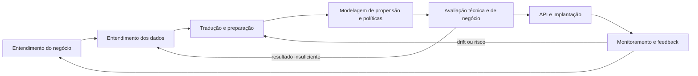
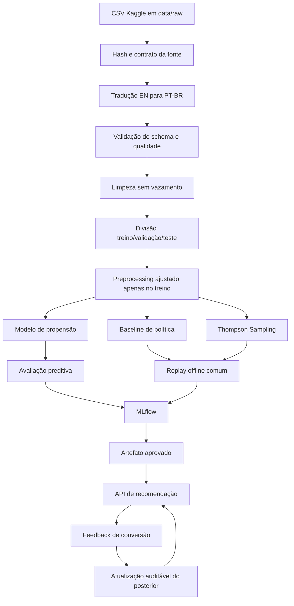
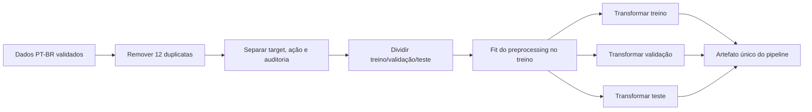
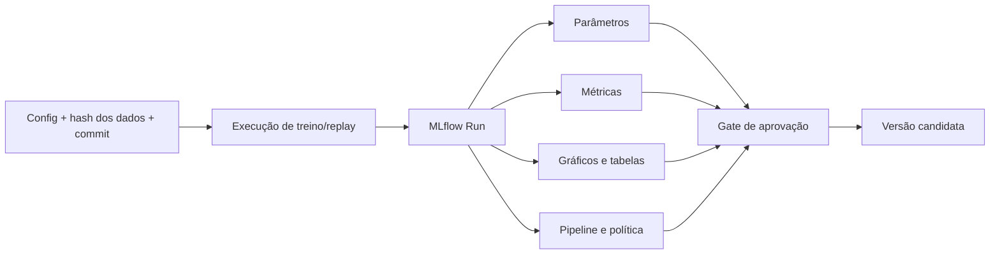
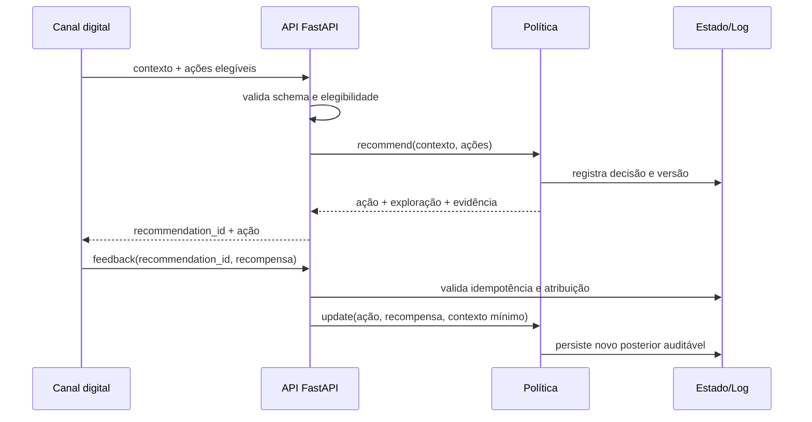
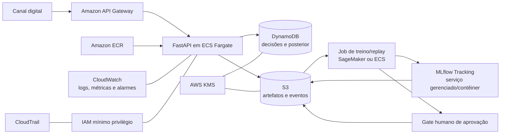
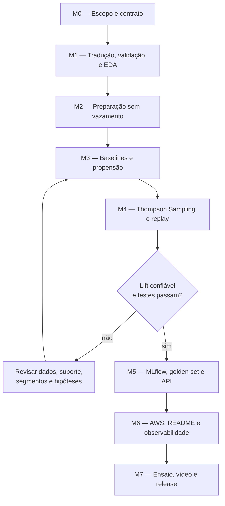

# Roadmap de implementação — Datathon 7MLET (Grupo 80)

> Documento de planejamento técnico derivado do [enunciado oficial](./fiap-postech-mlet-datathon.pdf) e do estado atual do repositório em 20/07/2026. O [README principal](../README.md) deverá receber, ao final, a documentação consolidada exigida pela banca. Este arquivo orienta a execução e não substitui essa entrega.

## 1. Resultado esperado

Construir uma solução ponta a ponta que recomende o próximo melhor canal de contato para um cliente elegível, aprenda com o retorno observado e demonstre, de forma reproduzível, quando uma política adaptativa supera uma política fixa.

A entrega deve combinar quatro resultados:

1. dados traduzidos e validados em português do Brasil, sem alterar a fonte bruta;
2. baseline preditivo e baseline determinístico comparáveis;
3. política adaptativa baseada em Thompson Sampling, avaliada com as limitações corretas de dados históricos;
4. API demonstrável, rastreamento no MLflow, testes, observabilidade, arquitetura AWS e documentação de negócio.

### Decisão de escopo que evita uma conclusão inválida

A base `Bank Marketing` contém uma única oferta observada — assinatura de depósito a prazo — e dois valores em `contact`: `cellular` e `telephone`. Ela não contém o resultado contrafactual de várias ofertas para o mesmo cliente.

Por isso, o MVP deverá definir:

| Conceito | Definição no projeto |
|---|---|
| Decisão | Qual canal usar no próximo contato elegível |
| Braços | `celular` e `telefone` |
| Recompensa | `1` se houve conversão; `0` caso contrário |
| Contexto | atributos disponíveis antes da decisão |
| Resultado da API | próximo melhor canal/ação, e não “produto ideal” |
| Limitação | associação histórica não prova efeito causal do canal |

Uma extensão futura poderá recomendar ofertas ou mensagens somente quando existir uma base com múltiplas ações, propensão de seleção e feedback por ação. Não se deve criar braços artificiais e apresentá-los como evidência factual.

## 2. Diagnóstico do repositório

### 2.1 O que já existe

- `README.md` com problema, fonte Kaggle, estrutura inicial e instruções básicas;
- `requirements.txt` com bibliotecas de análise e modelagem;
- base bruta com 41.188 linhas e 21 colunas;
- arquivo processado com 41.188 linhas e 64 colunas;
- notebook `01_EDA.ipynb` com estatísticas e gráficos iniciais.

### 2.2 Lacunas que precisam ser tratadas primeiro

| Lacuna | Evidência atual | Consequência | Ação planejada |
|---|---|---|---|
| Vazamento de target | `duration` está no arquivo processado | a duração só é conhecida depois do contato e infla artificialmente o desempenho | remover de qualquer feature de decisão |
| Pipeline não reproduzível | o notebook usa `df_processed`, mas não contém a célula que o cria | o CSV processado não pode ser regenerado do zero | mover transformações para `src/data` e chamar o mesmo código pelo notebook |
| Transformação antes da divisão | one-hot encoding já está aplicado em toda a base | risco de vazamento entre treino e teste | ajustar transformadores apenas no treino com `Pipeline`/`ColumnTransformer` |
| Valores “unknown” | a base não possui nulos, mas contém desconhecidos semânticos | a ausência real pode passar despercebida | preservar e medir `desconhecido` como categoria explícita |
| Duplicatas | existem 12 linhas integralmente duplicadas | pode contaminar divisões e métricas | remover com regra registrada e teste |
| Bandit ausente | não há braços, política, atualização ou replay | requisito central não atendido | implementar baseline fixo e Thompson Sampling |
| Avaliação incompleta | há apenas taxa geral de conversão | não demonstra qualidade preditiva nem ganho da política | adicionar métricas, incerteza, seeds e golden set |
| Operação ausente | não há API, MLflow, testes ou monitoramento | ciclo de MLE não está demonstrável | implementar camadas operacionais mínimas |
| Governança ausente | não há contrato de dados, retenção ou limites de uso | risco de uso indevido e baixa auditabilidade | documentar finalidade, minimização, riscos e humano no loop |

O arquivo `data/processed/bank_processed.csv` atual deve ser considerado provisório. Ele não deve ser usado como fonte oficial de treino até ser regenerado pelo pipeline versionado.

## 3. Rastreabilidade do enunciado

| Etapa do PDF | Situação inicial | Entrega planejada | Critério de conclusão |
|---|---|---|---|
| Etapa 0 — Organização | parcial | estrutura de código, dependências fixadas, README consolidado | instalação limpa e comandos documentados funcionam |
| Etapa 1 — Kaggle e EDA | parcial | notebook reproduzível, referência, licença, dicionário e análise de qualidade | EDA executa do início ao fim sem estado oculto |
| Etapa 2 — Preparação | parcial e com vazamento | tradução EN→PT-BR, validação, limpeza, divisão e preprocessing | `duration` ausente das features e artefatos regeneráveis |
| Etapa 3 — Baseline e algoritmo | ausente | baseline fixo, baseline preditivo e Thompson Sampling contextual por segmento | comparação justa, parâmetros documentados e lift reportado |
| Etapa 4 — Avaliação e testes | ausente | métricas preditivas/de política, incerteza e golden set de 5 casos | relatório reproduzível e casos revisados |
| Etapa 5 — Serviço | ausente | API FastAPI com recomendação, feedback e saúde | demonstração local responde aos exemplos válidos e rejeita inválidos |
| Etapa 6 — Nuvem | ausente | arquitetura-alvo AWS e fluxo operacional | parágrafos e diagrama incorporados ao README |
| Etapa 7 — MLOps | ausente | MLflow local com dados, parâmetros, métricas e artefatos | experimento pode ser localizado e comparado |
| Etapa 8 — Demo Day | ausente | roteiro e vídeo de até 5 minutos | mostra problema, evidência, API e limitações dentro do tempo |

## 4. Princípios de implementação

1. **Fonte bruta imutável:** nenhum processo sobrescreve `data/raw`.
2. **Transformação reproduzível:** notebooks consomem funções de `src`; não concentram lógica exclusiva.
3. **Sem vazamento:** apenas informações disponíveis antes da decisão entram no modelo.
4. **Comparação honesta:** baseline e política adaptativa usam o mesmo recorte, ordem, seeds e protocolo.
5. **Incerteza explícita:** resultados incluem intervalo de confiança e tamanho da amostra efetiva.
6. **Separação de responsabilidades:** predição de conversão, decisão da política e atualização por feedback são componentes distintos.
7. **Configuração versionada:** seeds, braços, prior, segmentos, limiares e caminhos não ficam espalhados no código.
8. **Privacidade por desenho:** sem identificadores reais; somente atributos necessários; logs sem payload pessoal completo.
9. **Humano no loop:** a recomendação é apoio à decisão e nunca executa automaticamente uma decisão sensível.
10. **Idioma consistente:** nomes de código em inglês; comentários, docstrings explicativas, documentação e mensagens ao usuário em PT-BR.

## 5. Visão CRISP-DM adaptada ao projeto



O ciclo não termina na criação do modelo. Conversões observadas atualizam a política; mudanças de distribuição, queda de recompensa ou risco de negócio provocam nova análise e treinamento.

### Métricas que definem sucesso

| Camada | Métrica principal | Métricas de apoio | Observação |
|---|---|---|---|
| Negócio | taxa de conversão/recompensa média | lift absoluto e relativo contra baseline | sempre apresentar volume e período simulados |
| Política | recompensa cumulativa | regret, taxa de exploração, distribuição de braços e cobertura do replay | comparar políticas no mesmo protocolo |
| Propensão | PR-AUC | ROC-AUC, recall, precision, F1, Brier score e curva de calibração | PR-AUC é importante pela classe positiva de aproximadamente 11,3% |
| Operação | latência p95 e erros | disponibilidade, feedback recebido, versão da política | metas locais devem ser registradas antes do teste |
| Governança | disparidade por fatia | cobertura, unknown rate e taxa de recomendação por grupo | diagnóstico, não justificativa automática para uso de proxy |

## 6. Arquitetura do repositório

Manter um único repositório modular reduz divergência entre notebook, treinamento e API e atende à exigência de documentação consolidada.

```text
datathon-7mlet-grupo-80/
├── configs/
│   ├── data.yaml
│   └── experiment.yaml
├── data/
│   ├── raw/                         # cópia imutável da fonte
│   ├── interim/                     # dados traduzidos e validados
│   └── processed/                   # splits/model-ready regeneráveis
├── notebooks/
│   ├── 01_eda.ipynb
│   ├── 02_preparation.ipynb
│   ├── 03_modeling_and_bandit.ipynb
│   └── 04_evaluation_and_golden_set.ipynb
├── src/
│   ├── data/
│   │   ├── contracts.py
│   │   ├── translate.py
│   │   ├── validate.py
│   │   └── prepare.py
│   ├── features/
│   │   └── build_features.py
│   ├── models/
│   │   ├── train_propensity.py
│   │   └── predict.py
│   ├── policies/
│   │   ├── base.py
│   │   ├── fixed.py
│   │   └── thompson_sampling.py
│   ├── evaluation/
│   │   ├── replay.py
│   │   ├── metrics.py
│   │   └── golden_set.py
│   └── api/
│       ├── main.py
│       ├── schemas.py
│       └── dependencies.py
├── tests/
│   ├── unit/
│   ├── integration/
│   └── fixtures/
├── artifacts/                       # artefatos locais ignorados pelo Git
├── specs/
├── .env.example
├── .gitignore
├── README.md
└── requirements.txt
```

## 7. Fluxo ponta a ponta



### Dependências e automação previstas

O `requirements.txt` atual cobre apenas a exploração inicial. Durante a implementação, separar ou comentar grupos e fixar versões compatíveis após validar o ambiente:

| Grupo | Dependências candidatas | Uso |
|---|---|---|
| Dados/modelagem | `pandas`, `numpy`, `scikit-learn`, `scipy`, `joblib`, `pyyaml` | preparação, modelos, bootstrap e configuração |
| Visualização/notebook | `matplotlib`, `seaborn`, `jupyter`, `nbconvert` | EDA e execução limpa dos notebooks |
| Serviço | `fastapi`, `uvicorn`, `pydantic` | API e contrato |
| MLOps | `mlflow` | tracking e artefatos |
| Qualidade | `pytest`, `httpx`, `ruff` | testes, cliente de teste e lint/format |

Adicionar comandos únicos — por exemplo, via `Makefile`, `Taskfile` ou scripts Python portáveis — para `prepare`, `train`, `evaluate`, `test` e `serve`. Fixar versões somente depois de testar a instalação do zero; não copiar um lock incompatível com o ambiente do grupo. O `.gitignore` deve excluir `.venv`, caches, credenciais, `mlruns`/banco local e artefatos gerados, preservando apenas amostras e evidências deliberadamente versionadas.

## 8. Roadmap por fase

### Fase 0 — Contrato do problema e governança

**CRISP-DM:** entendimento do negócio.

**Objetivo:** fixar o que a solução decide, para quem, com qual recompensa e sob quais restrições.

**Implementação:**

1. registrar a fonte Kaggle, a versão baixada, a data, a licença e o SHA-256 do CSV;
2. definir cliente elegível como um registro apto a receber contato no contexto demonstrativo;
3. documentar `celular` e `telefone` como os dois únicos braços factuais;
4. definir janela de atribuição da recompensa no experimento real; na base histórica, usar `resultado` como proxy;
5. listar features disponíveis antes da ação e bloquear features pós-ação;
6. declarar finalidade educacional, ausência de dados reais e proibição de decisões financeiras automáticas;
7. definir retenção: eventos de demonstração sem identificadores pessoais e descarte configurável;
8. registrar responsáveis pela aprovação do modelo, da política e da demonstração.

**Entregáveis:** seção de negócio no README, contrato de decisão em `configs/experiment.yaml` e registro de riscos.

**Gate de aceite:** qualquer integrante consegue explicar em um minuto qual é a ação, a recompensa, o contexto, o baseline e a limitação causal.

---

### Fase 1 — Tradução e canonicalização EN → PT-BR

**CRISP-DM:** entendimento e preparação dos dados.

**Objetivo:** criar uma camada canônica em PT-BR sem perder rastreabilidade com a fonte em inglês.

#### 1.1 Mapeamento de colunas

Usar `snake_case`, sem acentos nos nomes físicos, para interoperabilidade. Acentos podem ser preservados nos valores e na interface.

| Original | Canônica PT-BR | Regra/observação |
|---|---|---|
| `age` | `idade` | inteiro, validar faixa plausível |
| `job` | `profissao` | traduzir categorias |
| `marital` | `estado_civil` | traduzir categorias |
| `education` | `escolaridade` | traduzir categorias |
| `default` | `inadimplencia` | `sim`, `nao`, `desconhecido` |
| `housing` | `financiamento_habitacional` | `sim`, `nao`, `desconhecido` |
| `loan` | `emprestimo_pessoal` | `sim`, `nao`, `desconhecido` |
| `contact` | `canal_contato` | braço: `celular` ou `telefone` |
| `month` | `mes_contato` | abreviação PT-BR |
| `day_of_week` | `dia_semana` | abreviação PT-BR |
| `duration` | `duracao_contato` | manter apenas para auditoria/EDA; nunca usar na decisão |
| `campaign` | `contatos_campanha_atual` | validar valor mínimo |
| `pdays` | `dias_desde_ultimo_contato` | `999` exige tratamento semântico |
| `previous` | `contatos_campanhas_anteriores` | inteiro não negativo |
| `poutcome` | `resultado_campanha_anterior` | traduzir categorias |
| `emp.var.rate` | `taxa_variacao_emprego` | indicador macroeconômico |
| `cons.price.idx` | `indice_precos_consumidor` | indicador macroeconômico |
| `cons.conf.idx` | `indice_confianca_consumidor` | indicador macroeconômico |
| `euribor3m` | `euribor_3_meses` | indicador macroeconômico |
| `nr.employed` | `numero_empregados` | indicador macroeconômico agregado |
| `y` | `resultado` | `sim`→`1`, `nao`→`0`; preservar valor original em auditoria se necessário |

#### 1.2 Mapeamento mínimo de categorias

| Campo | Exemplos de mapeamento |
|---|---|
| `profissao` | `admin.`→`administrativo`, `blue-collar`→`operario`, `entrepreneur`→`empreendedor`, `housemaid`→`trabalhador_domestico`, `management`→`gestao`, `retired`→`aposentado`, `self-employed`→`autonomo`, `services`→`servicos`, `student`→`estudante`, `technician`→`tecnico`, `unemployed`→`desempregado`, `unknown`→`desconhecido` |
| `estado_civil` | `divorced`→`divorciado`, `married`→`casado`, `single`→`solteiro`, `unknown`→`desconhecido` |
| `escolaridade` | `basic.4y`→`basico_4_anos`, `basic.6y`→`basico_6_anos`, `basic.9y`→`basico_9_anos`, `high.school`→`ensino_medio`, `illiterate`→`analfabeto`, `professional.course`→`curso_profissionalizante`, `university.degree`→`ensino_superior`, `unknown`→`desconhecido` |
| `resultado_campanha_anterior` | `failure`→`fracasso`, `nonexistent`→`inexistente`, `success`→`sucesso` |
| meses | `apr`→`abr`, `aug`→`ago`, `may`→`mai`, `sep`→`set`, `dec`→`dez`; os demais já coincidem ou devem ser explicitados no dicionário |
| dias | `mon`→`seg`, `tue`→`ter`, `wed`→`qua`, `thu`→`qui`, `fri`→`sex` |
| booleanos e alvo | `yes`→`sim`, `no`→`nao`, `unknown`→`desconhecido` |

#### 1.3 Regras de implementação

- produzir `data/interim/bank_marketing_ptbr.csv`, nunca sobrescrever o original;
- salvar o mapeamento em código versionado, não apenas no notebook;
- falhar quando surgir coluna ou categoria não mapeada, salvo regra explícita de tolerância;
- comparar quantidade de linhas, tipos, distribuição do target e somas de controle antes/depois;
- registrar hash do arquivo de entrada e do arquivo traduzido;
- usar UTF-8 e testar leitura com acentos;
- manter um `event_id` técnico derivado da ordem da fonte, sem tratá-lo como feature.

Exemplo de convenção de idioma:

```python
def translate_dataset_to_ptbr(source_frame: pd.DataFrame) -> pd.DataFrame:
    """Traduz o contrato de dados sem alterar o DataFrame de origem."""
    # Cria uma cópia para garantir a imutabilidade da camada bruta.
    translated_frame = source_frame.copy(deep=True)

    # Renomeia as colunas com o dicionário canônico versionado.
    translated_frame = translated_frame.rename(columns=COLUMN_MAPPING)
    return translated_frame
```

**Entregáveis:** `translate.py`, `contracts.py`, CSV intermediário, dicionário no README e testes de mapeamento.

**Gate de aceite:** 41.188 registros antes da deduplicação, 21 campos de origem mapeados, nenhuma categoria silenciosamente perdida e target com 36.548 negativos/4.640 positivos antes da limpeza.

---

### Fase 2 — Entendimento dos dados e EDA reproduzível

**CRISP-DM:** entendimento dos dados.

**Objetivo:** transformar o notebook atual em evidência auditável para as decisões posteriores.

**Implementação:**

1. adicionar células Markdown com objetivo, fonte, unidade de observação e target;
2. usar as funções da Fase 1 para carregar e traduzir;
3. medir schema, duplicatas, valores `desconhecido`, sentinelas, cardinalidade e desbalanceamento;
4. analisar distribuições numéricas e categóricas;
5. calcular conversão por canal e por contexto, sempre exibindo também o suporte;
6. verificar associação entre `duracao_contato` e target somente para demonstrar por que ela vaza informação;
7. analisar `pdays=999` como “nunca contatado”, não como 999 dias reais;
8. incluir fatias de idade, profissão e escolaridade como diagnóstico de viés/proxy, sem transformá-las automaticamente em regras comerciais;
9. listar hipóteses, decisões tomadas e limitações;
10. executar o notebook do kernel limpo até o fim.

**Entregáveis:** `01_eda.ipynb` revisado e gráficos essenciais referenciados pelo README.

**Gate de aceite:** não existem variáveis ou DataFrames criados apenas por execução fora de ordem; todas as conclusões exibem denominador e não apenas percentual.

---

### Fase 3 — Preparação, divisão e engenharia de atributos

**CRISP-DM:** preparação dos dados.

**Objetivo:** gerar conjuntos de treino, validação e teste sem vazamento e com transformações reutilizáveis pela API.



#### Regras obrigatórias

- remover `duracao_contato` de `X` antes de qualquer treino;
- retirar `resultado`, `canal_contato` e `event_id` do contexto; `canal_contato` entra separadamente como ação;
- converter `pdays=999` em indicador `nunca_contatado_anteriormente=1` e valor ausente imputável para `dias_desde_ultimo_contato`;
- preservar `desconhecido` como categoria, pois não equivale a nulo técnico;
- ajustar imputação, encoder e escala somente no treino;
- usar `handle_unknown="ignore"` na API e monitorar novas categorias;
- fixar `random_state` em configuração;
- usar divisão estratificada para o MVP e declarar que a ausência de ano/data completa impede validação temporal rigorosa;
- manter o teste intocado até a avaliação final;
- não aplicar oversampling antes da divisão; se testado, aplicar apenas dentro do treino e registrar a alteração de calibração.

#### Conjuntos lógicos

| Conjunto | Finalidade | Pode atualizar parâmetros? |
|---|---|---|
| Treino | ajustar preprocessing, modelo e prior inicial | sim |
| Validação | escolher hiperparâmetros e segmentação | não diretamente; apenas selecionar configuração |
| Teste | estimativa final única | não |
| Stream de replay | simular decisões em ordem e feedback | apenas o estado online da política, nunca o preprocessing |

**Entregáveis:** `prepare.py`, `build_features.py`, pipeline serializável, splits e relatório de qualidade.

**Gate de aceite:** teste automatizado prova que `duracao_contato` não chega ao modelo; executar duas vezes com a mesma configuração produz os mesmos índices e hashes.

---

### Fase 4 — Baseline preditivo de conversão

**CRISP-DM:** modelagem e avaliação.

**Objetivo:** estimar propensão de conversão e criar uma referência técnica interpretável. Esse modelo não substitui a política adaptativa.

**Implementação:**

1. usar `DummyClassifier` como referência mínima;
2. treinar Regressão Logística como baseline interpretável;
3. opcionalmente comparar uma árvore/ensemble se trouxer ganho mensurável;
4. selecionar por PR-AUC e calibração na validação, não por acurácia;
5. calibrar probabilidades quando necessário;
6. avaliar no teste uma única vez;
7. produzir matriz de confusão com limiar de negócio explicitado;
8. registrar no MLflow dataset hash, lista de features, seed, parâmetros, métricas e artefato;
9. avaliar desempenho por fatias e versão reduzida sem atributos que funcionem como proxies sensíveis;
10. evitar linguagem causal: o modelo estima associação `P(conversão | contexto, ação observada)`.

**Entregáveis:** notebook de modelagem, script de treino, pipeline serializado e run do MLflow.

**Gate de aceite:** o modelo supera o Dummy em PR-AUC, apresenta Brier score/calibração e consegue inferir sobre um payload novo usando exatamente o preprocessing treinado.

---

### Fase 5 — Baseline de política e Thompson Sampling

**CRISP-DM:** modelagem.

**Objetivo:** comparar uma regra fixa com uma política que equilibra exploração e explotação.

#### 5.1 Baseline determinístico

Calcular no treino qual canal tem maior conversão histórica e escolher esse canal para todo cliente elegível. A decisão deve ser congelada antes de acessar validação/teste.

Registrar:

- canal escolhido;
- número de observações por canal;
- conversão e intervalo de confiança por canal;
- comportamento para canal indisponível;
- versão da regra.

#### 5.2 Política principal

Implementar Thompson Sampling Beta-Bernoulli:

- posterior por `(segmento, braço)`;
- prior inicial documentado, começando por `Beta(1, 1)`;
- análise de sensibilidade opcional com `Beta(0.5, 0.5)`;
- segmentos pequenos recorrem ao posterior global do braço;
- segmentos definidos apenas com contexto pré-decisão e suporte mínimo;
- recompensa binária atualiza somente o braço efetivamente selecionado;
- seed controlada para testes e múltiplas seeds para avaliação;
- estado do posterior versionado e persistido de forma atômica.

Segmentação inicial recomendada, sujeita a validação de suporte:

1. resultado da campanha anterior: `sucesso`, `fracasso`, `inexistente`;
2. indicador de contato anterior;
3. uma faixa operacional de contexto com poucos níveis.

Evitar cruzamentos de alta cardinalidade. Profissão, escolaridade e idade devem passar por análise de proxy/disparidade antes de controlar diretamente a política.

#### 5.3 Contrato comum de política

```python
class Policy(Protocol):
    def recommend(self, context: dict, eligible_actions: list[str]) -> Decision:
        """Seleciona uma ação elegível e registra a razão da decisão."""
        ...

    def update(self, action: str, reward: int, context: dict) -> None:
        """Atualiza apenas o estado associado ao feedback observado."""
        ...
```

**Entregáveis:** `fixed.py`, `thompson_sampling.py`, configuração de prior/segmentos e testes unitários.

**Gate de aceite:** com uma sequência sintética controlada, a política aprende a favorecer o braço de maior recompensa sem deixar de explorar; feedback duplicado não é aplicado duas vezes.

---

### Fase 6 — Avaliação offline confiável

**CRISP-DM:** avaliação.

**Objetivo:** demonstrar ganho sem confundir simulação com resultado causal de produção.

#### Protocolo primário: replay de eventos logados

Para cada evento de teste, em ordem estável:

1. a política recebe somente o contexto disponível antes da ação;
2. recomenda um canal;
3. se o canal coincide com o canal historicamente observado, a recompensa pode ser usada;
4. se não coincide, o evento é ignorado para recompensa porque o contrafactual é desconhecido;
5. a política adaptativa atualiza seu posterior somente nos eventos aceitos;
6. baseline e política adaptativa usam a mesma sequência.

Reportar obrigatoriamente:

- recompensa média e cumulativa;
- lift absoluto e relativo;
- número e percentual de eventos aceitos no replay;
- distribuição de escolhas por braço;
- regret quando houver referência simulada válida;
- intervalos de confiança por bootstrap;
- média e dispersão em pelo menos 30 seeds para a política estocástica.

#### Protocolo secundário: simulador baseado em reward model

Um modelo treinado apenas com treino pode estimar recompensa para pares `(contexto, ação)` e produzir uma simulação com números aleatórios comuns às políticas. O resultado deve aparecer como **simulação dependente do modelo**, nunca como conversão real ou efeito causal.

Não usar IPS como evidência principal sem conhecer a propensão da política histórica. Uma propensão estimada adiciona hipóteses fortes e deve ser declarada como análise exploratória.

#### Gate exigido pelo desafio

A política adaptativa deve superar o baseline fixo no protocolo pré-registrado e apresentar intervalo de confiança. Se não superar:

1. verificar suporte dos braços, segmentação, prior, bugs e vazamento;
2. ajustar apenas com treino/validação;
3. repetir o teste final somente com configuração congelada;
4. nunca escolher seed, subconjunto ou métrica apenas porque produz o resultado desejado;
5. documentar honestamente o resultado caso a base não sustente o ganho.

**Entregáveis:** `replay.py`, relatório comparativo, gráficos de recompensa acumulada/exploração e runs do MLflow.

**Gate de aceite:** qualquer integrante reproduz a tabela final a partir de uma configuração versionada e entende a diferença entre evidência offline, simulação e teste online.

---

### Fase 7 — Golden Set e explicabilidade

**CRISP-DM:** avaliação.

**Objetivo:** mostrar cinco decisões compreensíveis e estáveis, como exigido no PDF.

Criar cinco clientes fictícios ou anonimizados, sem copiar identificadores, cobrindo:

1. histórico anterior de sucesso;
2. histórico anterior de fracasso;
3. nenhum contato anterior;
4. categoria `desconhecido`;
5. indisponibilidade de um dos braços ou contexto limítrofe.

| Campo do caso | Conteúdo esperado |
|---|---|
| `case_id` | identificador sintético estável |
| contexto | somente campos pré-decisão |
| ações elegíveis | lista de canais permitidos |
| recomendação | braço escolhido |
| exploração | sim/não |
| evidência | parâmetros do posterior ou scores, sem alegação causal |
| avaliação humana | faz sentido, requer revisão ou inválido |
| versão | modelo, política e dados usados |

Os cinco casos devem virar fixture de teste. Evitar uma explicação falsa do tipo “recomendou porque a profissão é X”; explicar os sinais e a incerteza de forma agregada.

**Entregáveis:** `golden_set.json`, tabela no notebook/README e teste de contrato.

**Gate de aceite:** a API processa os cinco casos, retorna respostas válidas e a revisão humana registra justificativa e ressalvas.

---

### Fase 8 — MLOps com MLflow

**CRISP-DM:** modelagem, avaliação e implantação.

**Objetivo:** tornar experimentos comparáveis e artefatos rastreáveis.



Registrar em cada run:

- SHA-256 da base e versão do contrato;
- commit Git, seed e ambiente;
- features incluídas/excluídas;
- divisão e índices ou hash dos splits;
- hiperparâmetros do classificador;
- prior, segmentos, warm-up e regra de fallback da política;
- métricas preditivas e de política;
- cobertura do replay e intervalo de confiança;
- pipeline, modelo, estado inicial da política e gráficos;
- tags `candidate`, `approved` e `rejected`, ainda que o registry seja local.

**Entregáveis:** configuração local do MLflow, comando único de execução e evidência visual para o pitch.

**Gate de aceite:** a melhor execução pode ser identificada por critérios pré-definidos, reaberta e usada pela API sem procurar arquivos manualmente.

---

### Fase 9 — API demonstrável e ciclo de feedback

**CRISP-DM:** implantação.

**Objetivo:** receber contexto, recomendar uma ação elegível e registrar feedback com segurança básica.

#### Endpoints mínimos

| Método e rota | Função |
|---|---|
| `POST /v1/recommendations` | valida o contexto e retorna ação, versão e metadados de exploração |
| `POST /v1/feedback` | recebe `recommendation_id`, recompensa e timestamp; impede duplicidade |
| `GET /health` | informa vida do processo |
| `GET /ready` | confirma carregamento do modelo/estado |
| `GET /metrics` | expõe métricas técnicas sem dados pessoais, se adotado Prometheus |

Resposta mínima da recomendação:

```json
{
  "recommendation_id": "uuid",
  "recommended_action": "celular",
  "policy_version": "ts-1.0.0",
  "model_version": "propensity-1.0.0",
  "is_exploration": true,
  "reason": "Ação elegível selecionada pela política com incerteza controlada."
}
```

#### Fluxo online



#### Controles mínimos

- Pydantic com limites e enums;
- erro claro para payload inválido ou nenhuma ação elegível;
- `recommendation_id` idempotente no feedback;
- nenhuma atualização se o feedback não corresponder a uma decisão registrada;
- logs estruturados com correlação, latência e versão, sem payload completo;
- estado local em SQLite ou repositório abstrato para o MVP;
- endpoint não retorna atributos sensíveis nem probabilidades apresentadas como certeza;
- fallback para baseline aprovado se o artefato adaptativo não carregar.

**Entregáveis:** FastAPI, schemas, repositório de estado e coleção de exemplos `curl`/Swagger.

**Gate de aceite:** os cinco casos funcionam na API; testes cobrem sucesso, validação, idempotência, fallback e concorrência básica do estado.

---

### Fase 10 — Testes, qualidade e observabilidade

**CRISP-DM:** avaliação e implantação.

**Objetivo:** impedir regressões silenciosas no dado, modelo, política e serviço.

#### Pirâmide mínima de testes

| Nível | Casos indispensáveis |
|---|---|
| Dados | 21 colunas reconhecidas, categorias mapeadas, target preservado, 12 duplicatas detectadas, `duration` bloqueada |
| Unitário | tradução, sentinela 999, segmentação, amostragem com seed, update Beta, fallback, feedback idempotente |
| Integração | raw→interim→split→train→MLflow e artefato→API |
| Contrato | request/response da API e golden set |
| Smoke | servidor inicia, `/ready` responde e uma recomendação é gerada |

#### Monitoramento de produção simulado

| Categoria | Sinal | Ação sugerida |
|---|---|---|
| Qualidade | schema inválido, unknown rate, nulos e faixas | bloquear lote/payload ou acionar revisão |
| Drift | PSI/JS ou mudança de distribuição por feature | investigar e reavaliar o modelo |
| Política | queda de recompensa, regret, braço dominante e exploração | rollback/fallback e revisão do prior |
| Serviço | taxa de erro, latência p95 e disponibilidade | corrigir serviço ou escalar capacidade |
| Governança | disparidade por fatia, reclamações e overrides humanos | suspender automação e revisar uso |

Definir limiares usando o conjunto de referência, não números arbitrários copiados. Salvar o valor de referência e a justificativa.

**Entregáveis:** suíte `pytest`, lint/format, logs e painel/relatório local mínimo.

**Gate de aceite:** testes passam em ambiente limpo e um erro injetado de schema, artefato ausente e feedback duplicado produz o comportamento esperado.

---

### Fase 11 — Arquitetura-alvo AWS

**CRISP-DM:** implantação.

**Objetivo:** explicar como o MVP seria operado em nuvem com rastreabilidade, segurança e feedback.



#### Responsabilidade dos serviços

- **API Gateway + ECS Fargate:** exposição e execução da API conteinerizada;
- **ECR:** imagens versionadas;
- **S3:** datasets permitidos, relatórios e artefatos criptografados/versionados;
- **DynamoDB:** decisões, idempotência do feedback e estado da política com controle de concorrência;
- **SageMaker Processing/Training ou tarefa ECS:** treinamento e replay agendados;
- **MLflow:** rastreamento e aprovação de versões;
- **CloudWatch:** logs, métricas, dashboards e alarmes;
- **IAM, KMS e CloudTrail:** mínimo privilégio, criptografia e auditoria;
- **gate humano:** aprova promoção e rollback; nenhuma versão é publicada apenas por melhor métrica.

Para o desafio, não é necessário provisionar tudo. A entrega obrigatória é explicar essa arquitetura no README. Se houver deploy, iniciar com um ambiente único, limites de custo e dados somente sintéticos/educacionais.

**Gate de aceite:** o diagrama distingue treino, serving, estado, feedback, monitoramento e aprovação, e o README contém um ou dois parágrafos claros sobre AWS conforme solicitado.

---

### Fase 12 — README, Demo Day e encerramento

**CRISP-DM:** implantação e comunicação.

**Objetivo:** transformar os artefatos em uma história verificável de até cinco minutos.

#### Estrutura final obrigatória do README

1. resumo executivo e impacto de negócio;
2. definição precisa de ação, braços, recompensa e cliente elegível;
3. fonte Kaggle, versão, licença e dicionário;
4. alerta sobre `duration` e outras limitações;
5. EDA e preparação;
6. baseline versus política adaptativa, com tabela e intervalo de confiança;
7. golden set de cinco casos;
8. arquitetura AWS;
9. MLflow e versionamento;
10. governança, privacidade, fairness e humano no loop;
11. estrutura do repositório;
12. instalação e comandos exatos para dados, treino, teste, MLflow e API;
13. limitações e próximos passos;
14. link do vídeo final.

O PDF pede que a documentação da entrega seja consolidada no README. Os notebooks e este roadmap podem existir como artefatos técnicos, mas as evidências essenciais devem estar resumidas no README.

#### Roteiro do pitch — máximo de 5 minutos

| Tempo | Conteúdo |
|---|---|
| 0:00–0:40 | problema, impacto e decisão proposta |
| 0:40–1:20 | base, tradução PT-BR, vazamento removido e EDA |
| 1:20–2:20 | baseline, Thompson Sampling, exploração versus explotação |
| 2:20–3:10 | métricas, lift, incerteza e limitação offline |
| 3:10–4:20 | API ao vivo com dois casos e feedback |
| 4:20–4:50 | MLflow, AWS e observabilidade |
| 4:50–5:00 | conclusão e limite de uso responsável |

Preparar vídeo de contingência ou capturas locais caso a demo ao vivo falhe, sem exceder o tempo.

**Gate de aceite:** uma pessoa nova segue o README em ambiente limpo, reproduz o resultado principal e executa a API; o vídeo tem até cinco minutos.

## 9. Sequenciamento recomendado



### Pacotes de trabalho e dependências

| Marco | Conteúdo | Depende de | Saída verificável |
|---|---|---|---|
| M0 | Fase 0 | — | contrato aprovado |
| M1 | Fases 1–2 | M0 | dados PT-BR e EDA reproduzível |
| M2 | Fase 3 | M1 | splits e pipeline sem leakage |
| M3 | Fase 4 + baseline fixo | M2 | modelos e métricas iniciais |
| M4 | Fases 5–6 | M3 | política e comparação final |
| M5 | Fases 7–10 | M4 | serviço testado e rastreável |
| M6 | Fase 11 + README | M5 | documentação consolidada |
| M7 | Fase 12 | M6 | vídeo e tag de entrega |

## 10. Priorização para máxima cobertura

### P0 — obrigatório para submissão

- tradução rastreável e preparação reproduzível;
- remoção de `duration`;
- notebook de EDA;
- baseline fixo e Thompson Sampling;
- comparação com métrica e incerteza;
- golden set de cinco exemplos;
- API funcional;
- MLflow;
- README consolidado com AWS e execução;
- vídeo de até cinco minutos.

### P1 — alta qualidade técnica

- testes de dados/política/API;
- modelo de propensão calibrado;
- replay com múltiplas seeds e bootstrap;
- persistência idempotente de feedback;
- análise de drift, fairness/proxy e observabilidade;
- container e automação de comandos.

### P2 — extensão após o P0/P1 estável

- Epsilon-Greedy ou UCB para comparação adicional;
- avaliação doubly robust apenas com hipóteses explícitas;
- CI, container registry e deploy real;
- dashboard de monitoramento;
- nova base com ofertas/mensagens reais como braços;
- experimento online controlado com logging propensity.

## 11. Registro de riscos

| Risco | Probabilidade/impacto | Mitigação | Evidência de controle |
|---|---|---|---|
| Chamar canal de “oferta” | alta/alta | contrato de decisão e copy revisada | README/API usam “canal/ação” |
| Vazamento por duração | alta/alta | denylist e teste automático | feature list e teste |
| Adaptive não superar baseline | média/alta | protocolo pré-registrado, suporte, segmentação parcimoniosa | relatório sem cherry-picking |
| Viés do logging histórico | alta/alta | replay com cobertura e limitação causal | cobertura e seção de limites |
| Pouco suporte em telefone/celular por segmento | média/alta | suporte mínimo e fallback global | relatório por segmento |
| Acurácia enganar pelo desbalanceamento | alta/média | PR-AUC, calibração e métricas por classe | MLflow/README |
| Treino-serving skew | média/alta | serializar um único pipeline | teste de integração |
| Feedback duplicado | média/alta | chave idempotente | teste e armazenamento |
| Estado concorrente corrompido | média/alta | atualização atômica/versionada | teste de concorrência |
| Proxy discriminatório | média/alta | análise por fatia, versão reduzida e gate humano | relatório de governança |
| Demo falhar | média/média | smoke test e captura de contingência | checklist pré-demo |
| Custo AWS inesperado | baixa/média | não provisionar no MVP ou usar limites/budgets | decisão documentada |

## 12. Definition of Done global

O projeto só está pronto quando todos os itens abaixo forem verdadeiros:

- [ ] A base bruta permanece byte a byte inalterada e tem hash registrado.
- [ ] A tradução PT-BR é completa, versionada e testada.
- [ ] O pipeline é executável do zero em ambiente limpo.
- [ ] `duracao_contato` não entra em nenhuma decisão ou treino.
- [ ] Preprocessing é ajustado apenas no treino.
- [ ] Baseline fixo e política adaptativa usam o mesmo protocolo.
- [ ] Thompson Sampling tem prior, fallback, exploração e atualização documentados.
- [ ] Resultado principal inclui lift, intervalo de confiança, cobertura e seeds.
- [ ] Limitações causais/offline aparecem junto ao resultado, não em nota escondida.
- [ ] MLflow registra configuração, métricas, hashes e artefatos.
- [ ] Golden set contém cinco casos e passa pela API.
- [ ] Feedback é idempotente e auditável.
- [ ] Testes de dados, política e API passam.
- [ ] README consolida todos os itens obrigatórios do PDF.
- [ ] Arquitetura AWS explica serving, estado, feedback, treino, segurança e monitoramento.
- [ ] Vídeo demonstra recomendação funcionando em até cinco minutos.
- [ ] Uma pessoa que não participou do desenvolvimento consegue reproduzir a entrega.

## 13. Comandos-alvo de reprodução

Os comandos exatos devem ser confirmados durante a implementação, mas a experiência final deve convergir para algo equivalente a:

```bash
python -m venv .venv
python -m pip install -r requirements.txt
python -m src.data.prepare --config configs/data.yaml
python -m src.models.train_propensity --config configs/experiment.yaml
python -m src.evaluation.replay --config configs/experiment.yaml
pytest
mlflow ui
uvicorn src.api.main:app --reload
```

No Windows PowerShell, documentar também a ativação de `.venv` e evitar assumir ferramentas Unix. Todas as execuções devem produzir logs claros em PT-BR, retornar código de saída diferente de zero em falhas e não depender da ordem de execução dos notebooks.

## 14. Próximo passo imediato

Executar M0 e M1 antes de ampliar o notebook atual: criar o contrato de decisão, o dicionário de tradução e os testes de paridade da base. Em seguida, regenerar o dataset processado sem `duration` e só então iniciar baseline, Thompson Sampling e API. Essa ordem elimina o maior risco de retrabalho e garante que todas as etapas posteriores usem o mesmo contrato de dados.
